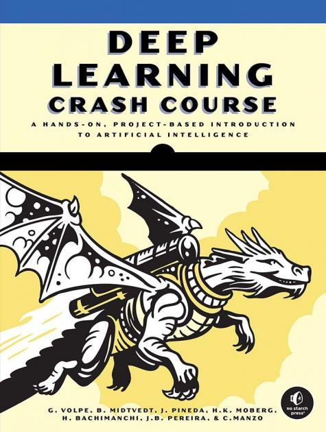

# Deep Learning Crash Course

<!--
  
-->

  

by Giovanni Volpe, Benjamin Midtvedt, Jesús Pineda, Henrik Klein Moberg, Harshith Bachimanchi, Joana B. Pereira, Carlo Manzo  
No Starch Press, San Francisco (CA), 2026  
ISBN-13: 9781718503922  
[https://nostarch.com/deep-learning-crash-course](https://nostarch.com/deep-learning-crash-course)  

---

1. [Dense Neural Networks for Classification](https://github.com/DeepTrackAI/DeepLearningCrashCourse/tree/main/Ch01_DNN_classification)  

2. [Dense Neural Networks for Regression](https://github.com/DeepTrackAI/DeepLearningCrashCourse/tree/main/Ch02_DNN_regression)  

3. [Convolutional Neural Networks for Image Analysis](https://github.com/DeepTrackAI/DeepLearningCrashCourse/tree/main/Ch03_CNN)  

4. **Encoders–Decoders for Latent Space Manipulation**  
   Focuses on autoencoders, variational autoencoders, Wasserstein autoencoders, and anomaly detection, enabling data compression and generation.

>   - [**Code 4-1: Denoising Images with a Denoising Encoder-Decoder**](https://github.com/DeepTrackAI/DeepLearningCrashCourse/tree/main/Ch04_AE/ec04_1_denoising/denoising.ipynb)   
>     Implements a denoising encoder–decoder that cleans noisy microscopy images. It illustrates how to simulate noisy vs. clean pairs, train a small convolutional model to learn noise removal, and verify that the network isn’t simply memorizing one output (checking for mode collapse).
>
>   - [**Code 4-A: Generating Digit Images with Variational Autoencoders**](https://github.com/DeepTrackAI/DeepLearningCrashCourse/tree/main/Ch04_AE/ec04_A_vae_mnist/vae_mnist.ipynb)   
>     Shows how to implement a variational autoencoder (VAE) on MNIST digits. The encoder outputs a mean and variance for latent variables, and the decoder reconstructs digits from sampled latent points. The notebook demonstrates random sampling to create new digit images and visualizes how the VAE organizes digits in the latent space.
>
>   - [**Code 4-B: Morphing Images with Wasserstein Autoencoders**](https://github.com/DeepTrackAI/DeepLearningCrashCourse/tree/main/Ch04_AE/ec04_B_wae_fashionmnist/wae_fashionmnist.ipynb)   
>     Explores a Wasserstein autoencoder (WAE) trained on Fashion-MNIST. You’ll see how to decode random latent points to generate clothing/accessory images and how to interpolate (morph) one image into another in latent space, showcasing the smooth transitions that WAEs learn.
>
>   - [**Code 4-C: Detecting ECG Anomalies with an Autoencoder**](https://github.com/DeepTrackAI/DeepLearningCrashCourse/tree/main/Ch04_AE/ec04_C_anomaly_detection/anomaly_detection.ipynb)   
>     Uses a 1D convolutional autoencoder to detect abnormal heartbeats in ECG data. It’s trained exclusively on normal ECGs so that reconstruction error (or distance in latent space) highlights anomalies that deviate from learned “normal” patterns. Demonstrates how to set a threshold for detecting anomalous signals and compares two approaches: reconstruction-based vs. neighbor-based in latent space.

5. [U-Nets for Image Transformation](https://github.com/DeepTrackAI/DeepLearningCrashCourse/tree/main/Ch05_UNet)  

6. [Self-Supervised Learning to Exploit Symmetries](https://github.com/DeepTrackAI/DeepLearningCrashCourse/tree/main/Ch06_SelfSupervised)  

7. [Recurrent Neural Networks for Timeseries Analysis](https://github.com/DeepTrackAI/DeepLearningCrashCourse/tree/main/Ch07_RNN)  

8. [Attention and Transformers for Sequence Processing](https://github.com/DeepTrackAI/DeepLearningCrashCourse/tree/main/Ch08_Attention)  

9. [Generative Adversarial Networks for Image Synthesis](https://github.com/DeepTrackAI/DeepLearningCrashCourse/tree/main/Ch09_GAN)  

10. [Diffusion Models for Data Representation and Exploration](https://github.com/DeepTrackAI/DeepLearningCrashCourse/tree/main/Ch10_Diffusion)  

11. [Graph Neural Networks for Relational Data Analysis](https://github.com/DeepTrackAI/DeepLearningCrashCourse/tree/main/Ch11_GNN)  

12. [Active Learning for Continuous Learning](https://github.com/DeepTrackAI/DeepLearningCrashCourse/tree/main/Ch12_AL)  

13. [Reinforcement Learning for Strategy Optimization](https://github.com/DeepTrackAI/DeepLearningCrashCourse/tree/main/Ch13_RL)  

14. [Reservoir Computing for Predicting Chaos](https://github.com/DeepTrackAI/DeepLearningCrashCourse/tree/main/Ch14_RC)  

---
