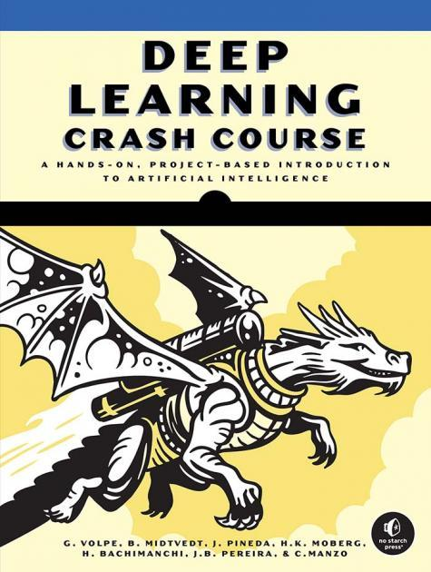

# Deep Learning Crash Course

<!--
  
-->

  

by Giovanni Volpe, Benjamin Midtvedt, Jesús Pineda, Henrik Klein Moberg, Harshith Bachimanchi, Joana B. Pereira, Carlo Manzo  
No Starch Press, San Francisco (CA), 2026  
ISBN-13: 9781718503922  
[https://nostarch.com/deep-learning-crash-course](https://nostarch.com/deep-learning-crash-course)  

---

1. [Building and Training Your First Neural Network](https://github.com/DeepTrackAI/DeepLearningCrashCourse/tree/main/Ch01_DNN_classification)  

2. [Capturing Trends and Recognizing Patterns with Dense Neural Networks](https://github.com/DeepTrackAI/DeepLearningCrashCourse/tree/main/Ch02_DNN_regression)  

3. [Processing Images with Convolutional Neural Networks](https://github.com/DeepTrackAI/DeepLearningCrashCourse/tree/main/Ch03_CNN)  

4. [Enhancing, Generating, and Analyzing Data with Autoencoders](https://github.com/DeepTrackAI/DeepLearningCrashCourse/tree/main/Ch04_AE)  

5. [Segmenting and Analyzing Images with U-Nets](https://github.com/DeepTrackAI/DeepLearningCrashCourse/tree/main/Ch05_UNet)  

6. [Training Neural Networks with Self-Supervised Learning](https://github.com/DeepTrackAI/DeepLearningCrashCourse/tree/main/Ch06_SelfSupervised)  

7. [Processing Time Series and Language with Recurrent Neural Networks](https://github.com/DeepTrackAI/DeepLearningCrashCourse/tree/main/Ch07_RNN)  

8. [Processing Language and Classifying Images with Attention and Transformers](https://github.com/DeepTrackAI/DeepLearningCrashCourse/tree/main/Ch08_Attention)  

9. [Creating and Transforming Images with Generative Adversarial Networks](https://github.com/DeepTrackAI/DeepLearningCrashCourse/tree/main/Ch09_GAN)  

10. [Implementing Generative AI with Diffusion Models](https://github.com/DeepTrackAI/DeepLearningCrashCourse/tree/main/Ch10_Diffusion)  

11. [Modeling Molecules and Complex Systems with Graph Neural Networks](https://github.com/DeepTrackAI/DeepLearningCrashCourse/tree/main/Ch11_GNN)  

12. [Continuously Improving Performance with Active Learning](https://github.com/DeepTrackAI/DeepLearningCrashCourse/tree/main/Ch12_AL)  

13. [Mastering Decision-Making with Deep Reinforcement Learning](https://github.com/DeepTrackAI/DeepLearningCrashCourse/tree/main/Ch13_RL)  

14. [Predicting Chaos with Reservoir Computing](https://github.com/DeepTrackAI/DeepLearningCrashCourse/tree/main/Ch14_RC)  

CC. **Companion Examples**  
    Provides additional examples complementing those in the book.

>   - [**Code Companion PINN: Solving the Heat Equation with a Physics-Informed Neural Network**](https://github.com/DeepTrackAI/DeepLearningCrashCourse/tree/main/Companion/cc_pinn/pinn.ipynb)   
>     Demonstrates how physical laws can be incorporated directly into the training process of a neural network. The notebook uses automatic differentiation to enforce the heat equation while learning from only a small number of observations, illustrating how PINNs can combine data and domain knowledge to solve differential equations.

>   - [**Code Companion NormFlows: Learning Probability Distributions with Normalizing Flows**](https://github.com/DeepTrackAI/DeepLearningCrashCourse/tree/main/Companion/cc_normflows/normflows.ipynb)   
>     Demonstrates how normalizing flows learn complex probability distributions through a sequence of invertible neural-network transformations. The notebook implements a RealNVP model from scratch to transform a simple Gaussian distribution into a two-moons dataset, illustrating exact likelihood training, latent-space representations, and probabilistic generative modeling.

---
